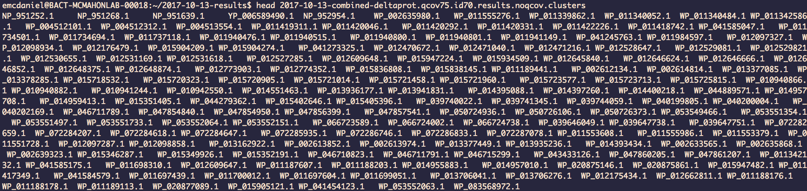
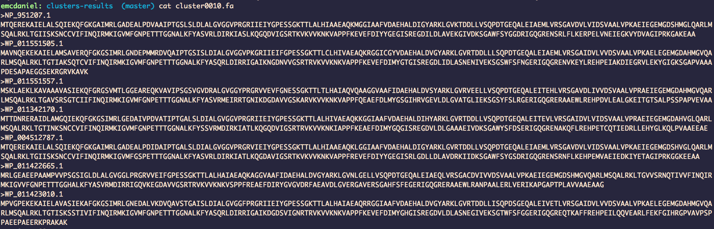

# Biopython Example from Liz

This script takes a collection of clusters produced by the program MCL (Markov Cluster Algorithm), and for each cluster makes an individual .fa file. Each cluster contains a collection of proteins. Using SeqIO from Biopython, it reads the fasta record ID and sequence from the concatenated FASTA file, matches it with the protein found in the cluster, and creates the collection of .fa files. Here is a visual representation of what is happening:

1. MCL output

MCL gives all collections of all proteins, and the clusters are separated by tabs. This is really messy at the moment. My script first creates separate cluster files for the proteins to be stored in to easily parse the information. Then given the concatenated FASTA file, the dictionary script matches up the ID/sequence within each cluster to create individual .fa files for downstream analyses using `from Bio import SeqIO`. The output looks like this:

2. Collection of cluster .fa files

Where each cluster###.fa file looks like this (for example `cluster0010.fa`):

Whereas before it was just a list of proteins in a non-human readable form to figure out clusters, I now have separated clusters with the corresponding sequences to those proteins. Now I can use these collections of .fa cluster files to find proteins of interest for downstream analyses.
